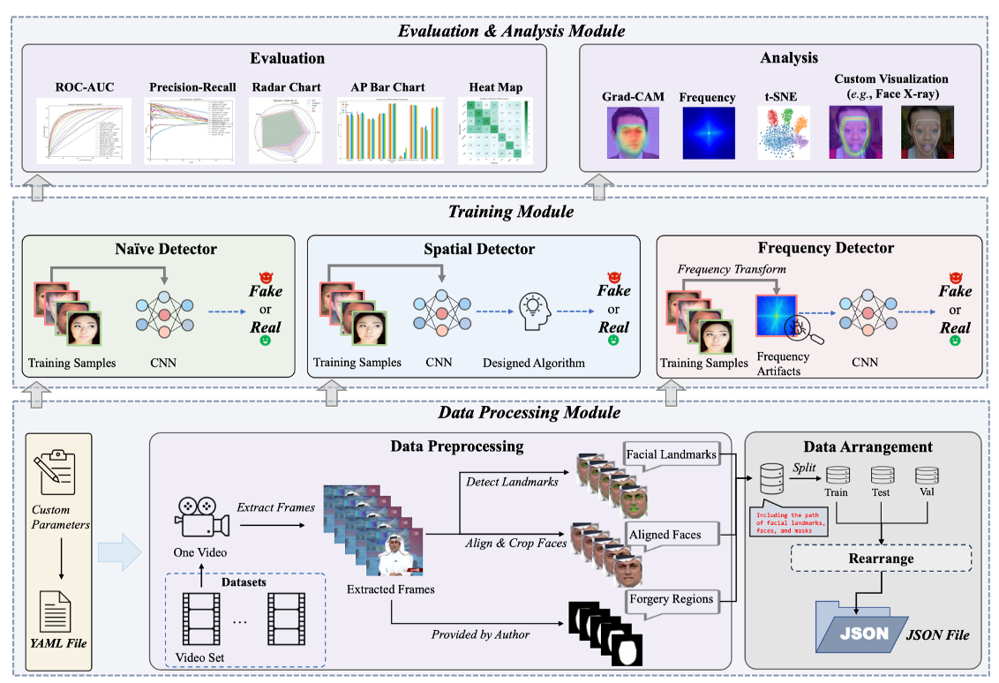

# DeepfakeBench: A Comprehensive Benchmark of Deepfake Detection (NeurIPS 2023 D&B)

[](https://creativecommons.org/licenses/by-nc/4.0/)   

<b> Authors: <a href='https://yzy-stack.github.io/'>Zhiyuan Yan</a>, <a href='https://yzhang2016.github.io/'>Yong Zhang</a>, Xinhang Yuan, <a href='https://cse.buffalo.edu/~siweilyu/'>Siwei Lyu</a>, <a href='https://sites.google.com/site/baoyuanwu2015/'>Baoyuan Wu* </a>  </b>

[[paper](https://arxiv.org/abs/2307.01426)] [[pre-trained weights](https://github.com/SCLBD/DeepfakeBench/releases/tag/v1.0.1)]

---

<div align="center"> 
</div>
<div style="text-align:center;">
  
</div>

Welcome to *DeepfakeBench*, your one-stop solution for deepfake detection! Here are some key features of our platform:

> ✅ **Unified Platform**: *DeepfakeBench* presents the first comprehensive benchmark for deepfake detection, resolving the issue of lack of standardization and uniformity in this field.
> 
> ✅ **Data Management**: *DeepfakeBench* provides a unified data management system that ensures consistent input across all detection models.
> 
> ✅ **Integrated Framework**: *DeepfakeBench* offers an integrated framework for the implementation of state-of-the-art detection methods.
> 
> ✅ **Standardized Evaluations**: *DeepfakeBench* introduces standardized evaluation metrics and protocols to enhance the transparency and reproducibility of performance evaluations.
> 
> ✅ **Extensive Analysis and Insights**: *DeepfakeBench* facilitates an extensive analysis from various perspectives, providing new insights to inspire the development of new technologies.

---

<font size=4><b> Table of Contents </b></font>

- [Features](#-features)
- [Quick Start](#-quick-start)
  - [Installation](#1-installation)
  - [Download Data](#2-download-data)
  - [Preprocessing (optional)](#3-preprocessing-optional)
  - [Rearrangement](#4-rearrangement)
  - [Training (optional)](#4-training-optional)
  - [Evaluation](#5-evaluation)
- [Supported Detectors](#-supported-detectors)
- [Results](#-results)
- [Citation](#-citation)
- [Copyright](#%EF%B8%8F-license)

---


## 📚 Features
<a href="#top">[Back to top]</a>

DeepfakeBench has the following features:

⭐️  **Detectors** (**34** detectors):
  - 5 Naive Detectors: [Xception](./training/detectors/xception_detector.py), [MesoNet](./training/detectors/meso4_detector.py), [MesoInception](./training/detectors/meso4Inception_detector.py), [CNN-Aug](./training/detectors/resnet34_detector.py), [EfficientNet-B4](./training/detectors/efficientnetb4_detector.py)
  - 19 Spatial Detectors: [Capsule](./training/detectors/capsule_net_detector.py), [DSP-FWA](./training/detectors/fwa_detector.py), [Face X-ray](./training/detectors/facexray_detector.py), [FFD](./training/detectors/ffd_detector.py), [CORE](./training/detectors/core_detector.py), [RECCE](./training/detectors/recce_detector.py), [UCF](./training/detectors/ucf_detector.py), [Local-relation](./training/detectors/lrl_detector.py), [IID](./training/detectors/lrl_detector.py), [RFM](./training/detectors/rfm_detector.py), [SIA](./training/detectors/sia_detector.py), [SLADD](./training/detectors/sladd_detector.py), [UIA-ViT](./training/detectors/uia_vit_detector.py), [CLIP](./training/detectors/clip_detector.py), [SBI](./training/detectors/sbi_detector.py), [PCL-I2G](./training/detectors/pcl_xception_detector.py), [Multi-Attention](./training/detectors/multi_attention_detector.py), [LSDA](./training/detectors/lsda_detector.py)
  - 3 Frequency Detectors: [F3Net](./training/detectors/f3net_detector.py), [SPSL](./training/detectors/spsl_detector.py), [SRM](./training/detectors/srm_detector.py)
  - 7 Video Detectors: [TALL](./training/detectors/tall_detector.py), [I3D](./training/detectors/i3d_detector.py), [STIL](./training/detectors/stil_detector.py), [FTCN](./training/detectors/ftcn_detector.py), [X-CLIP](./training/detectors/xclip_detector.py), [TimeTransformer](./training/detectors/timesformer_detector.py), [VideoMAE](./training/detectors/videomae_detector.py)

The table below highlights the **update** new detectors compared to our original DeepfakeBench version.

|                  | File name                               | Paper                                                                                                                                                                                                                                                                                                                                                         |
|------------------|-----------------------------------------|---------------------------------------------------------------------------------------------------------------------------------------------------------------------------------------------------------------------------------------------------------------------------------------------------------------------------------------------------------------|
| AltFreezing          | [altfreezing_detector.py](./training/detectors/altfreezing_detector.py)         | [AltFreezing for More General Video Face Forgery Detection](https://openaccess.thecvf.com/content/CVPR2023/papers/Wang_AltFreezing_for_More_General_Video_Face_Forgery_Detection_CVPR_2023_paper.pdf) CVPR 2023 |
| TALL          | [tall_detector.py](./training/detectors/tall_detector.py)         | [TALL: Thumbnail Layout for Deepfake Video Detection](https://openaccess.thecvf.com/content/ICCV2023/papers/Xu_TALL_Thumbnail_Layout_for_Deepfake_Video_Detection_ICCV_2023_paper.pdf) ICCV 2023 |
| LSDA          | [lsda_detector.py](./training/detectors/lsda_detector.py)         | [Transcending forgery specificity with latent space augmentation for generalizable deepfake detection](https://arxiv.org/pdf/2311.11278) CVPR 2024 |
| IID          | [iid_detector.py](./training/detectors/iid_detector.py)       | [Implicit Identity Driven Deepfake Face Swapping Detection](https://openaccess.thecvf.com/content/CVPR2023/papers/Huang_Implicit_Identity_Driven_Deepfake_Face_Swapping_Detection_CVPR_2023_paper.pdf) CVPR 2023                                                                                                                                                                                                                                     |
| SBI          | [sbi_detector.py](./training/detectors/sbi_detector.py)       | [Detecting Deepfakes with Self-Blended Images](https://arxiv.org/pdf/2204.08376) CVPR 2022                                                                                                                                                                                                                                             |
| SLADD              | [sladd_detector.py](./training/detectors/sladd_detector.py)               | [Self-supervised Learning of Adversarial Example: Towards Good Generalizations for Deepfake Detection](https://arxiv.org/abs/2203.12208) CVPR 2022                                            |
| FTCN | [ftcn_detector.py](./training/detectors/ftcn_detector.py)                 | [Exploring Temporal Coherence for More General Video Face Forgery Detection](https://openaccess.thecvf.com/content/ICCV2021/papers/Zheng_Exploring_Temporal_Coherence_for_More_General_Video_Face_Forgery_Detection_ICCV_2021_paper.pdf) ICCV 2021                                                                                                 |
| PCL-I2G    | [pcl_xception_detector.py](./training/detectors/pcl_xception_detector.py)                 | [Learning Self-Consistency for Deepfake Detection](https://openaccess.thecvf.com/content/ICCV2021/papers/Zhao_Learning_Self-Consistency_for_Deepfake_Detection_ICCV_2021_paper.pdf) ICCV 2021                                                                                                                                |
| Local-relation             | [lrl_detector.py](./training/detectors/lrl_detector.py)             | [Local Relation Learning for Face Forgery Detection](https://arxiv.org/pdf/2105.02577) AAAI 2021                                                                                                                                               |
| UIA-ViT              | [uia_vit_detector.py](./training/detectors/uia_vit_detector.py)               | [UIA-ViT: Unsupervised Inconsistency-Aware Method based on Vision Transformer for Face Forgery Detection](https://www.ecva.net/papers/eccv_2022/papers_ECCV/papers/136650384.pdf) ECCV 2022                                                                                                                                                                                                                                           |
| SIA             | [sia_detector.py](./training/detectors/sia_detector.py)             | [An Information Theoretic Approach for Attention-Driven Face Forgery Detection](https://www.ecva.net/papers/eccv_2022/papers_ECCV/papers/136740105.pdf) ECCV 2022                                                                                                                                                                                                     |
| Multi-attention         | [multi_attention_detector.py](./training/detectors/multi_attention_detector.py)     | [Multi-Attentional Deepfake Detection](https://openaccess.thecvf.com/content/CVPR2021/html/Zhao_Multi-Attentional_Deepfake_Detection_CVPR_2021_paper.html) CVPR 2021                                                                                                                                                                                               |
| CLIP            | [clip_detector.py](./training/detectors/clip_detector.py)           | [Learning Transferable Visual Models From Natural Language Supervision](https://arxiv.org/abs/2103.00020) ICML 2021                                                                                                                                                                                   |
| STIL  | [stil_detector.py](./training/detectors/stil_detector.py)     | [Spatiotemporal Inconsistency Learning for DeepFake Video Detection](https://dl.acm.org/doi/pdf/10.1145/3474085.3475508) ACMMM 2021                                                                                                                                                                                                                                                                                 |
| RFM   | [rfm_detector.py](./training/detectors/rfm_detector.py)       | [Representative Forgery Mining for Fake Face Detection](https://openaccess.thecvf.com/content/CVPR2021/papers/Wang_Representative_Forgery_Mining_for_Fake_Face_Detection_CVPR_2021_paper.pdf) CVPR 2021                                                                                                                                                                                                                                                                   |
| TimeTransformer    | [timetransformer_detector.py](./training/detectors/timesformer_detector.py)         | [Is space-time attention all you need for video understanding?](https://proceedings.mlr.press/v139/bertasius21a/bertasius21a-supp.pdf) ICML 2021                                                       |
| VideoMAE    | [videomae_detector.py](./training/detectors/videomae_detectors.py)         | [Videomae: Masked autoencoders are data-efficient learners for self-supervised video pre-training](https://proceedings.neurips.cc/paper_files/paper/2022/file/416f9cb3276121c42eebb86352a4354a-Paper-Conference.pdf) NIPS 2022                                                       |
| X-CLIP    | [xclip_detector.py](./training/detectors/xclip_detector.py)         | [Expanding Language-Image Pretrained Models for General Video Recognition](https://arxiv.org/pdf/2208.02816) ECCV 2022                                                       |


⭐️ **Datasets** (9 datasets): [FaceForensics++](https://github.com/ondyari/FaceForensics), [FaceShifter](https://github.com/ondyari/FaceForensics/tree/master/dataset), [DeepfakeDetection](https://github.com/ondyari/FaceForensics/tree/master/dataset), [Deepfake Detection Challenge (Preview)](https://ai.facebook.com/datasets/dfdc/), [Deepfake Detection Challenge](https://www.kaggle.com/c/deepfake-detection-challenge/data), [Celeb-DF-v1](https://github.com/yuezunli/celeb-deepfakeforensics/tree/master/Celeb-DF-v1), [Celeb-DF-v2](https://github.com/yuezunli/celeb-deepfakeforensics), [DeepForensics-1.0](https://github.com/EndlessSora/DeeperForensics-1.0/tree/master/dataset), [UADFV](https://docs.google.com/forms/d/e/1FAIpQLScKPoOv15TIZ9Mn0nGScIVgKRM9tFWOmjh9eHKx57Yp-XcnxA/viewform)


## ⏳ Quick Start

### 1. Installation
(option 1) You can run the following script to configure the necessary environment:

```
git clone git@github.com:SCLBD/DeepfakeBench.git
cd DeepfakeBench
conda create -n DeepfakeBench python=3.7.2
conda activate DeepfakeBench
sh install.sh
```

(option 2) You can also utilize the supplied [`Dockerfile`](./Dockerfile) to set up the entire environment using Docker. This will allow you to execute all the codes in the benchmark without encountering any environment-related problems. Simply run the following commands to enter the Docker environment.

```
docker build -t DeepfakeBench .
docker run --gpus all -itd -v /path/to/this/repository:/app/ --shm-size 64G DeepfakeBench
```
Note we used Docker version `19.03.14` in our setup. We highly recommend using this version for consistency, but later versions of Docker may also be compatible.

### 2. Download Data

<a href="#top">[Back to top]</a>

All datasets used in DeepfakeBench can be downloaded from their own websites or repositories and preprocessed accordingly.
For convenience, we also provide the data we use in our research, including:

| Types                     | Links| Notes|       
| -------------------------|------- | ----------------------- |
| **Rgb-format Datasets**  | [Baidu, Password: ogjn](https://pan.baidu.com/s/1NAMUHcZvsIm7l6hMHeEQjQ?pwd=ogjn), [Google Drive](https://drive.google.com/drive/folders/1N4X3rvx9IhmkEZK-KIk4OxBrQb9BRUcs?usp=drive_link) | Preprocessed data|       
| **Lmdb-format Datasets** | [Baidu, Password: g3gj](https://pan.baidu.com/s/1riMCN5iXTJ2g9fQjtlZswg?pwd=g3gj)| LMDB database for each dataset|       
| **Json Configurations**  | [Baidu, Password: dcwv](https://pan.baidu.com/s/1d7PTV2GK-fpGibcbtnQDqQ?pwd=dcwv), [Google Drive](https://drive.google.com/drive/folders/1ZV3fz5MZZU5BTB5neziN6i8Yv0Z21_LO?usp=drive_link)| Data arrangement|       
     
All the downloaded datasets are already **preprocessed** to cropped faces (32 frames per video) with their masks and landmarks, which can be **directly deployed to evaluate our benchmark**.

The provided datasets are:

| Dataset Name                    | Notes                   |
| ------------------------------- | ----------------------- |
| Celeb-DF-v1                     | -                       |
| Celeb-DF-v2                     | -                       |
| FaceForensics++, DeepfakeDetection, FaceShifter | Only c23      |
| UADFV                           | -                       |
| Deepfake Detection Challenge (Preview) | -                       |
| Deepfake Detection Challenge     |  Only Test Data                       |

🛡️ **Copyright of the above datasets belongs to their original providers.**


Other detailed information about the datasets used in DeepfakeBench is summarized below:


| Dataset | Real Videos | Fake Videos | Total Videos | Rights Cleared | Total Subjects | Synthesis Methods | Perturbations | Original Repository |
| --- | --- | --- | --- | --- | --- | --- | --- | --- |
| FaceForensics++ | 1000 | 4000 | 5000 | NO | N/A | 4 | 2 | [Hyper-link](https://github.com/ondyari/FaceForensics/tree/master/dataset) |
| FaceShifter | 1000 | 1000 | 2000 | NO | N/A | 1 | - | [Hyper-link](https://github.com/ondyari/FaceForensics/tree/master/dataset) |
| DeepfakeDetection | 363 | 3000 | 3363 | YES | 28 | 5 | - | [Hyper-link](https://github.com/ondyari/FaceForensics/tree/master/dataset) |
| Deepfake Detection Challenge (Preview) | 1131 | 4119 | 5250 | YES | 66 | 2 | 3 | [Hyper-link](https://ai.facebook.com/datasets/dfdc/) |
| Deepfake Detection Challenge | 23654 | 104500 | 128154 | YES | 960 | 8 | 19 | [Hyper-link](https://www.kaggle.com/c/deepfake-detection-challenge/data) |
| CelebDF-v1 | 408 | 795 | 1203 | NO | N/A | 1 | - | [Hyper-link](https://github.com/yuezunli/celeb-deepfakeforensics/tree/master/Celeb-DF-v1) |
| CelebDF-v2 | 590 | 5639 | 6229 | NO | 59 | 1 | - | [Hyper-link](https://github.com/yuezunli/celeb-deepfakeforensics) |
| DeepForensics-1.0 | 50000 | 10000 | 60000 | YES | 100 | 1 | 7 | [Hyper-link](https://github.com/EndlessSora/DeeperForensics-1.0/tree/master/dataset) |
| UADFV | 49 | 49 | 98 | NO | 49 | 1 | - | [Hyper-link](https://docs.google.com/forms/d/e/1FAIpQLScKPoOv15TIZ9Mn0nGScIVgKRM9tFWOmjh9eHKx57Yp-XcnxA/viewform) |


Upon downloading the datasets, please ensure to store them in the [`./datasets`](./datasets/) folder, arranging them in accordance with the directory structure outlined below:

```
datasets
├── lmdb
|   ├── FaceForensics++_lmdb
|   |   ├── data.mdb
|   |   ├── lock.mdb
├── rgb
|   ├── FaceForensics++
|   │   ├── original_sequences
|   │   │   ├── youtube
|   │   │   │   ├── c23
|   │   │   │   │   ├── videos
|   │   │   │   │   │   └── *.mp4
|   │   │   │   │   └── frames (if you download my processed data)
|   │   │   │   │   │   └── *.png
|   |   |   |   |   └── masks (if you download my processed data)
|   │   │   │   │   │   └── *.png
|   │   │   │   │   └── landmarks (if you download my processed data)
|   │   │   │   │   │   └── *.png
|   │   │   │   └── c40
|   │   │   │   │   ├── videos
|   │   │   │   │   │   └── *.mp4
|   │   │   │   │   └── frames (if you download my processed data)
|   │   │   │   │   │   └── *.png
|   |   |   |   |   └── masks (if you download my processed data)
|   │   │   │   │   │   └── *.png
|   │   │   │   │   └── landmarks (if you download my processed data)
|   │   │   │   │       └── *.npy
|   │   │   ├── actors
|   │   │   │   ├── c23
|   │   │   │   │   ├── videos
|   │   │   │   │   │   └── *.mp4
|   │   │   │   │   └── frames (if you download my processed data)
|   │   │   │   │   │   └── *.png
|   |   |   |   |   └── masks (if you download my processed data)
|   │   │   │   │   │   └── *.png
|   │   │   │   │   └── landmarks (if you download my processed data)
|   │   │   │   │       └── *.npy
|   │   │   │   └── c40
|   │   │   │   │   ├── videos
|   │   │   │   │   │   └── *.mp4
|   │   │   │   │   └── frames (if you download my processed data)
|   │   │   │   │   │   └── *.png
|   |   |   |   |   └── masks (if you download my processed data)
|   │   │   │   │   │   └── *.png
|   │   │   │   │   └── landmarks (if you download my processed data)
|   │   │   │   │       └── *.npy
|   │   ├── manipulated_sequences
|   │   │   ├── Deepfakes
|   │   │   │   ├── c23
|   │   │   │   │   └── videos
|   │   │   │   │   │   └── *.mp4
|   │   │   │   │   └── frames (if you download my processed data)
|   │   │   │   │   │   └── *.png
|   |   |   |   |   └── masks (if you download my processed data)
|   │   │   │   │   │   └── *.png
|   │   │   │   │   └── landmarks (if you download my processed data)
|   │   │   │   │       └── *.npy
|   │   │   │   └── c40
|   │   │   │   │   ├── videos
|   │   │   │   │   │   └── *.mp4
|   │   │   │   │   └── frames (if you download my processed data)
|   │   │   │   │   │   └── *.png
|   |   |   |   |   └── masks (if you download my processed data)
│   │   │   │   |   │   └── *.png
│   │   │   │   |   └── landmarks (if you download my processed data)
│   │   │   |   │       └── *.npy
│   │   |   ├── Face2Face
│   |   │   │   ├── ...
|   │   │   ├── FaceSwap
|   │   │   │   ├── ...
|   │   │   ├── NeuralTextures
|   │   │   │   ├── ...
|   │   │   ├── FaceShifter
|   │   │   │   ├── ...
|   │   │   └── DeepFakeDetection
|   │   │       ├── ...
Other datasets are similar to the above structure
```

If you choose to store your datasets in a different folder, you may specified the `rgb_dir` or `lmdb_dir` in `training\test_config.yaml` and `training\train_config.yaml`.

The downloaded json configurations should be arranged as:
```
preprocessing
├── dataset_json
|   ├── FaceForensics++.json
```

You may also store your configurations in a different folder by specifying the `dataset_json_folder` in `training\test_config.yaml` and `training\train_config.yaml`.

### 3. Preprocessing (optional)

<a href="#top">[Back to top]</a>

**❗️Note**: If you want to directly utilize the data, including frames, landmarks, masks, and more, that I have provided above, you can skip the pre-processing step. **However, you still need to run the rearrangement script to generate the JSON file** for each dataset for the unified data loading in the training and testing process.

DeepfakeBench follows a sequential workflow for face detection, alignment, and cropping. The processed data, including face images, landmarks, and masks, are saved in separate folders for further analysis.

To start preprocessing your dataset, please follow these steps:

1. Download the [shape_predictor_81_face_landmarks.dat](https://github.com/SCLBD/DeepfakeBench/releases/download/v1.0.0/shape_predictor_81_face_landmarks.dat) file. Then, copy the downloaded shape_predictor_81_face_landmarks.dat file into the `./preprocessing/dlib_tools folder`. This file is necessary for Dlib's face detection functionality.

2. Open the [`./preprocessing/config.yaml`](./preprocessing/config.yaml) and locate the line `default: DATASET_YOU_SPECIFY`. Replace `DATASET_YOU_SPECIFY` with the name of the dataset you want to preprocess, such as `FaceForensics++`.

7. Specify the `dataset_root_path` in the config.yaml file. Search for the line that mentions dataset_root_path. By default, it looks like this: ``dataset_root_path: ./datasets``.
Replace `./datasets` with the actual path to the folder where your dataset is arranged. 

Once you have completed these steps, you can proceed with running the following line to do the preprocessing:

```
cd preprocessing

python preprocess.py
```
You may skip the preprocessing step by downloading the provided data.

### 4. Rearrangement
To simplify the handling of different datasets, we propose a unified and convenient way to load them. The function eliminates the need to write separate input/output (I/O) code for each dataset, reducing duplication of effort and easing data management.

After the preprocessing above, you will obtain the processed data (*i.e., frames, landmarks, and masks*) for each dataset you specify. Similarly, you need to set the parameters in `./preprocessing/config.yaml` for each dataset. After that, run the following line:
```
cd preprocessing

python rearrange.py
```
After running the above line, you will obtain the JSON files for each dataset in the `./preprocessing/dataset_json` folder. The rearranged structure organizes the data in a hierarchical manner, grouping videos based on their labels and data splits (*i.e.,* train, test, validation). Each video is represented as a dictionary entry containing relevant metadata, including file paths, labels, compression levels (if applicable), *etc*. 


### 5. Training (optional)

<a href="#top">[Back to top]</a>

To run the training code, you should first download the pretrained weights for the corresponding **backbones** (These pre-trained weights are from ImageNet). You can download them from [Link](https://github.com/SCLBD/DeepfakeBench/releases/download/v1.0.0/pretrained.zip). After downloading, you need to put all the weights files into the folder `./training/pretrained`.

Then, you should go to the `./training/config/detector/` folder and then Choose the detector to be trained. For instance, you can adjust the parameters in [`xception.yaml`](./training/config/detector/xception.yaml) to specify the parameters, *e.g.,* training and testing datasets, epoch, frame_num, *etc*.

After setting the parameters, you can run with the following to train the Xception detector:

```
python training/train.py \
--detector_path ./training/config/detector/xception.yaml
```

You can also adjust the training and testing datasets using the command line, for example:

```
python training/train.py \
--detector_path ./training/config/detector/xception.yaml  \
--train_dataset "FaceForensics++" \
--test_dataset "Celeb-DF-v1" "Celeb-DF-v2"
```

By default, the checkpoints and features will be saved during the training process. If you do not want to save them, run with the following:

```
python training/train.py \
--detector_path ./training/config/detector/xception.yaml \
--train_dataset "FaceForensics++" \
--test_dataset "Celeb-DF-v1" "Celeb-DF-v2" \
--no-save_ckpt \
--no-save_feat
```

For **multi-gpus training** (DDP), please refer to [`train.sh`](./train.sh) file for details.

To train other detectors using the code mentioned above, you can specify the config file accordingly. However, for the Face X-ray detector, an additional step is required before training. To save training time, a pickle file is generated to store the Top-N nearest images for each given image. To generate this file, you should run the [`generate_xray_nearest.py`](./training/dataset/generate_xray_nearest.py) file. Once the pickle file is created, you can train the Face X-ray detector using the same way above. If you want to check/use the files I have already generated, please refer to the [`link`](https://github.com/SCLBD/DeepfakeBench/releases/tag/v1.0.2).


### 6. Evaluation
If you only want to evaluate the detectors to produce the results of the cross-dataset evaluation, you can use the the [`test.py`](./training/test.py) code for evaluation. Here is an example:

```
python3 training/test.py \
--detector_path ./training/config/detector/xception.yaml \
--test_dataset "Celeb-DF-v1" "Celeb-DF-v2" "DFDCP" \
--weights_path ./training/weights/xception_best.pth
```
**Note that we have provided the pre-trained weights for each detector (you can download them from the [`link`](https://github.com/SCLBD/DeepfakeBench/releases/tag/v1.0.1)).** Make sure to put these weights in the `./training/weights` folder.


## 📝 Citation

<a href="#top">[Back to top]</a>

```
@inproceedings{DeepfakeBench_YAN_NEURIPS2023,
 author = {Yan, Zhiyuan and Zhang, Yong and Yuan, Xinhang and Lyu, Siwei and Wu, Baoyuan},
 booktitle = {Advances in Neural Information Processing Systems},
 editor = {A. Oh and T. Neumann and A. Globerson and K. Saenko and M. Hardt and S. Levine},
 pages = {4534--4565},
 publisher = {Curran Associates, Inc.},
 title = {DeepfakeBench: A Comprehensive Benchmark of Deepfake Detection},
 url = {https://proceedings.neurips.cc/paper_files/paper/2023/file/0e735e4b4f07de483cbe250130992726-Paper-Datasets_and_Benchmarks.pdf},
 volume = {36},
 year = {2023}
}
```